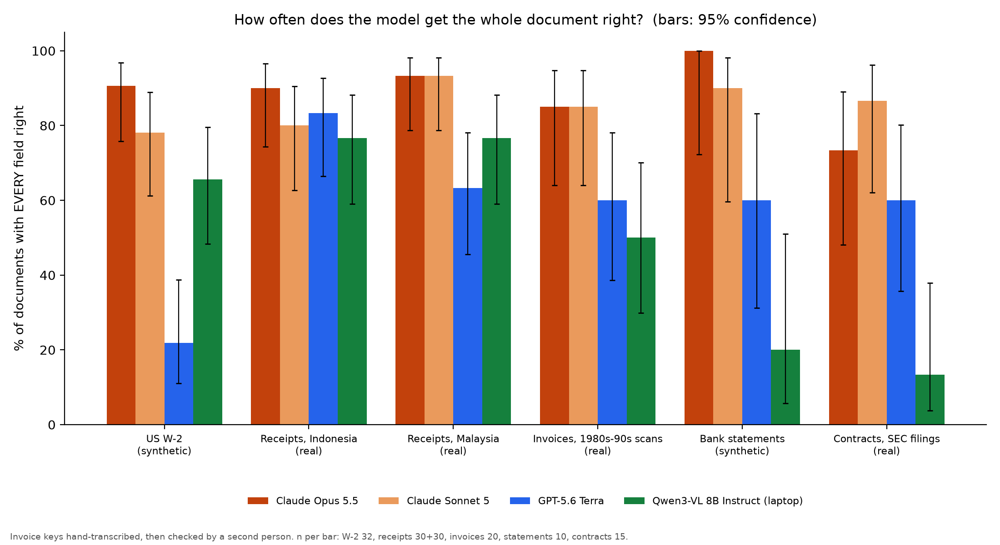

# messy-docs-bench

How often does an AI model get a whole business document right, on messy real-world scans?

137 documents, 4 models, strict scoring. A field counts only if its value is right: `02-06-89` and `1989-02-06` match, `8,010.42` and `6,010.42` do not. The headline number is **documents with every field right**, because one wrong field means a person has to check the whole document.



## Results (single pass, run 2026-09-26)

| Model | Fields right | Documents fully right |
|---|---|---|
| Claude Opus 5.5 | 98.1% | 89% (122/137) |
| Claude Sonnet 5 | 97.6% | 85% (116/137) |
| Qwen3-VL 8B Instruct, Q4_K_M, on a laptop | 92.7% | 59% (81/137) |
| GPT-5.6 Terra | 89.3% | 57% (78/137) |

Per-type numbers with 95% Wilson intervals are in `results/summary.json`. Every raw model output is in `results/raw/<model>/<variant>/`.

## Documents

| Set | n | Real? | Source and licence | Fields scored |
|---|---|---|---|---|
| US W-2 | 32 | Synthetic, filled on the official IRS form, 4 damage levels | Generated by `make_tax.py`. SSNs use the never-issued 900-999 range | 17 boxes |
| Receipts, Indonesia | 30 | Real | CORD v2 test split, CC-BY-4.0 | total, subtotal, tax, every line item |
| Receipts, Malaysia | 30 | Real | ICDAR 2019 SROIE test split (jsdnrs/ICDAR2019-SROIE), CC-BY-4.0 | company, date, address, total |
| Invoices | 20 | Real 1980s-90s scans | RVL-CDIP invoice class. Images not redistributed here; IDs in `answer_keys/invoices` | vendor, invoice number, date, total. Keys hand-transcribed and human-verified |
| Bank statements | 10 | Synthetic scans | AgamiAI Indian Bank Statements, Apache-2.0 | 7 header fields + every transaction row |
| Contracts | 15 | Real SEC filings | CUAD v1, CC-BY-4.0 | 6 lawyer-labelled fields |

`python3 prep_docs.py` downloads the public sets and rebuilds the answer keys.

## Method

- Same prompt for every model (`tasks.py`). Images sent at full resolution (`detail: high` for OpenAI-style APIs).
- Claude models ran through the Claude Code CLI with no tools, no MCP servers and no settings, from an empty folder.
- The local model ran through Ollama. The default `qwen3-vl:8b` tag is the thinking variant, ignores `think: false`, and on long contracts spent its whole 4,096-token budget thinking. Results use `qwen3-vl:8b-instruct`.
- "Self-check" variant: the model gets its own first answer plus the document and is asked to correct it. For GPT-5.6 Terra, 119 of 137 answers came back identical; it fixed 1 document and broke 1.
- `test_score.py` checks that the scorer accepts format differences and rejects value differences (31 cases).

## Limits

- 10 to 32 documents per type. Differences of a few points are noise: two identical GPT-5.6 Terra runs differed by up to 4 points on one type.
- W-2s and bank statements are synthetic. The W-2s were generated for this run, so no model has seen them; the public sets may be in training data.
- Invoice keys were transcribed by the author, then every field was checked by a second person against the image. Twelve published-label fields where most models disagreed were checked against the images too. At least 4 of the 30 SROIE receipts used here have a wrong published key (for example 'B1750' where the receipt prints 81750). Every adjustment and its reason is in `answer_keys/verification_notes.json`; fields where two readings are defensible are skipped or accept either reading.
- Before the human check, the author's own invoice labels scored Claude Opus at 90%; after it, 85%. Labels written by a model family can favour that family.
- Gemini and GPT-5.6 Luna were not run. The self-check variant was run for GPT-5.6 Terra only.
- Cost per document was under 1 US cent for every model at list prices.

## Run it

```
pip install pymupdf faker pyarrow python-dateutil scrapling matplotlib
python3 make_tax.py 32 && python3 prep_docs.py
python3 run.py <model names from models.py>
python3 score.py && python3 report.py
```

Code: MIT. Data: see each source's licence above.
